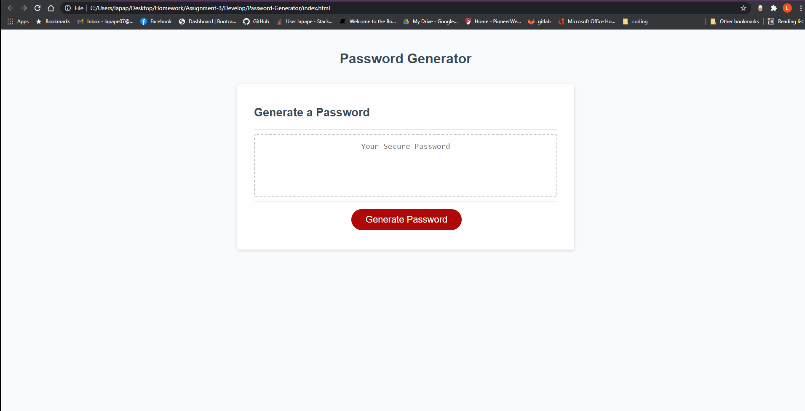

# Password-Generator

## Description

The purpose of this site is to generate a password with random characters of a certain length. It will generate a secure password for the user. I leanred a lot about functions and loops while working on this project.

## Installation

Utalize an updated broweser to view the page.

## Usage

Click the button and follow the prompts. After all prompts are answered, the password will display in the textbox.
`md 

## Credits

I would like to thank my study group: Alex Jurgs, Lauren Gabaldon, Chip Long, Joshua Lee, and Jared Sutch. They were a helpful set of fresh eyes to help me with troubleshooting.

## License

None.
